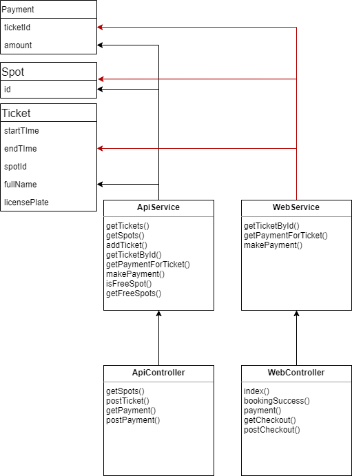
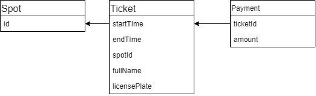

# Car Park Management System

## Project group
* Sergei Protasov - 300245809
* Obika Stanley - 300314126
* Sevilay Ardik - 300323961

## Class diagram

* WebController - SpringBoot controller that handles web-pages.
* ApiController -  SpringBoot controller that handles REST api requests.
* Ticket - A class that contains information about a ticket (e.g: start time, end time, car number, person name…)
* Payment - Contains payment transaction data (ticket number, amount paid)
* ApiService - Handles all api business logic
* WebService - Handles all web business logic
* Spot - Information about car park spot

## Database Schema
